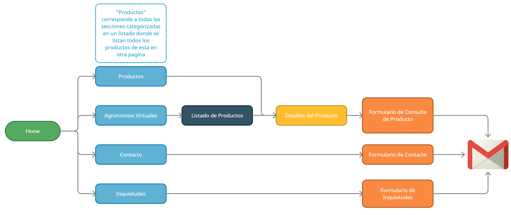

# Agroganas

>Plataforma Web de Agroganas

## Descripcion

Plataforma dedicada al rubro de la Agricultura y ganaderia y variantes a fines, ofreciendo un sitio donde las empresas agricolas y los particulares publiquen ya sea productos o servicios.

Las empresas cuentan con la posibilidad de tener un espacio dentro de la plataforma donde se pueden ver unicamente las publicaciones realizadas por la misma. Esta seccion es denominada "Agronomia Virtual", la cual esta subdividida en secciones de interes para el cliente.

La plataforma a su vez cuenta con una sección de administrador en donde solo los usuarios designados pueden crear, modificar o borrar publicaciones y Agronomias Virtuales.

## Flujos de la Plataforma

* Flujo de utilizacion y acceso para un cliente en la plataforma

* Flujo de utilizacion y acceso para administrador en la plataforma

## Detalles del Proyecto

### Tecnologias Aplicadas

* HTML, CSS y JavaScript Vanilla
* jQuery
* Bootstrap 4.6 + plugins
* Chart.js
* JotForm
* Filepond y Filepond Image Preview

### Servicios Utilizados

* Firebase Hosting
* Firebase Firestore
* Firebase Authentication

### Seguridad de la plataforma

* Firebase Rules: Se definieron las reglas para que solo un usuario designado, al estar logueado, pueda cargar archivos y documentos unicamente. La lectura esta abierta al publico.

### Diseño de la plataforma

* El diseño de la plataforma esta adaptado a Desktop, Tablet y mobile (responsive)

## Autor

Desarrollador y Diseñador del proyecto

Oliva Clariá, Benjamín  
* Linkedin: [https://www.linkedin.com/in/benjamin-oliva-clariá-953454181](https://www.linkedin.com/in/benjamin-oliva-clariá-953454181)
* Instagram: [@benjaaoliva](https://instagram.com/benjaaoliva/)
* 

## Historial de Versiones

* 1.0
    * Publicacion del Proyecto en GitHub

## Etapa del Desarrollo

* El proyecto se encuentra funcional, se estan terminando algunos detalles y funciones menos relevantes para el cliente que solicito la Plataforma

## Herramientas de desarrollo

* Visual Studio Code
    * Extensiones:
        * [Live Server](https://marketplace.visualstudio.com/items?itemName=ritwickdey.LiveServer)
        * [Bookmarks](https://marketplace.visualstudio.com/items?itemName=alefragnani.Bookmarks)
        * [Firebase Explorer](https://marketplace.visualstudio.com/items?itemName=jsayol.firebase-explorer)
        * Otras extensiones de formateo de codigo...
* Navegador Brave
* GitHub Desktop App

## Créditos de Uso e Inspiraciones

Diseños y Templates utilizados e inspiraciones para el diseño y funciones.
* [SB-Admin-2](https://startbootstrap.com/theme/sb-admin-2)
* [Bootstrap Carousel](https://getbootstrap.com/docs/4.0/examples/carousel/)
