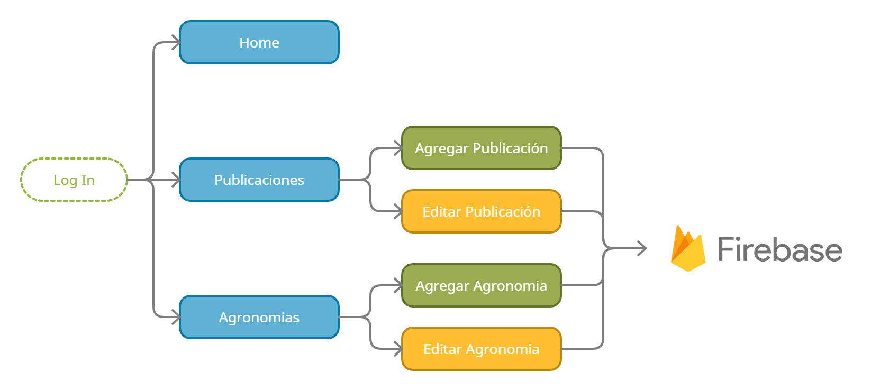

# Agroganas

Plataforma Web de Agroganas

## Descripcion

Plataforma dedicada al rubro de la Agricultura y ganaderia y variantes a fines, ofreciendo un sitio donde las empresas agricolas y los particulares publiquen ya sea productos o servicios.

Las empresas cuentan con la posibilidad de tener un espacio dentro de la plataforma donde se pueden ver unicamente las publicaciones realizadas por la misma. Esta seccion es denominada "Agronomia Virtual", la cual esta subdividida en secciones de interes para el cliente.

La plataforma a su vez cuenta con una sección de administrador en donde solo los usuarios designados pueden crear, modificar o borrar publicaciones y Agronomias Virtuales.

### Flujos de la Plataforma

* Flujo de utilizacion y acceso para un cliente en la plataforma


* Flujo de utilizacion y acceso para administrador en la plataforma


## Detalles del Proyecto

### Tecnologias Aplicadas

* HTML, CSS y JavaScript Vanilla
* jQuery
* Bootstrap 4.6 + plugins
* Chart.js
* JotForm
* Filepond y Filepond Image Preview

### Servicios Utilizados

* Firebase Hosting
* Firebase Firestore
* Firebase Authentication

## Help

Any advise for common problems or issues.
```
command to run if program contains helper info
```

## Autor

Desarrollador y Diseñador del proyecto

Oliva Clariá, Benjamín  
 * Instagram: [@benjaaoliva](https://instagram.com/benjaaoliva/)
* Linkedin: [https://www.linkedin.com/in/benjamin-oliva-clariá-953454181](https://www.linkedin.com/in/benjamin-oliva-clariá-953454181)

## Historial de Versiones

* 1.0
    * Publicacion del Proyecto en GitHub

## Creditos de Uso e Inspiraciones

Diseños y Templates utilizados e inspiraciones para el diseño y funciones.
* [SB-Admin-2](https://startbootstrap.com/theme/sb-admin-2)
* [Bootstrap Carousel](https://getbootstrap.com/docs/4.0/examples/carousel/)
